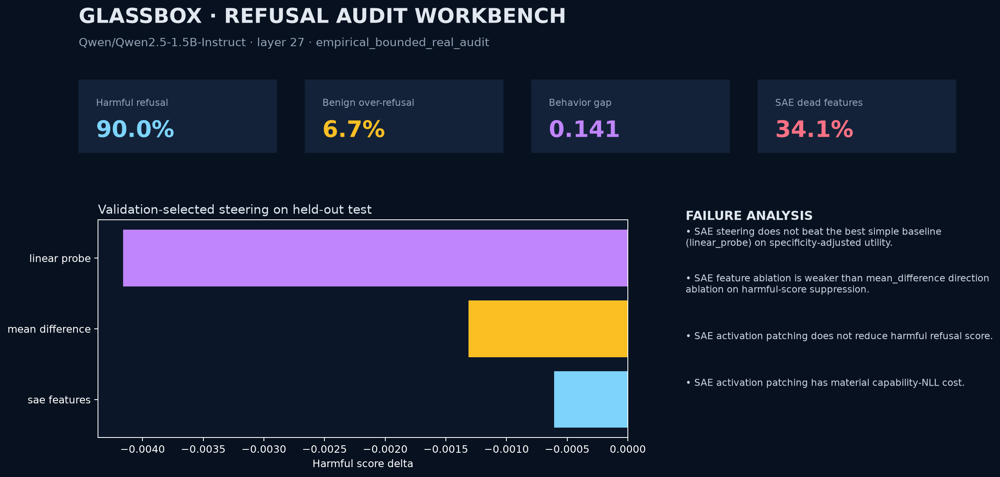

# Glassbox Audit

**A causal activation-level audit of refusal behavior that preserves the negative result.**

Glassbox asks whether sparse autoencoder features explain refusal behavior better than simpler activation directions. The final supported claim is deliberately narrow:

> Glassbox found a robust late residual-stream refusal-relevant direction in Qwen2.5-1.5B, with partial Qwen2.5-3B replication and external causal transfer, but did not confirm a full circuit. SAE features beat matched random-SAE controls but did not beat mean/probe baselines under preregistered held-out criteria.



## Result Snapshot

| Result family | Status | Main readout |
|---|---|---|
| Qwen2.5-1.5B expanded audit | completed | layer 27 replicated; mean ablation `-0.136`; SAE ablation `-0.036`; H1 passed, H3 failed |
| SAE stability grid | completed | 6/6 cells; 0/6 preregistered SAE-vs-baseline passes |
| OR-Bench external causal transfer | completed | transfer present; SAE not mean-superior |
| Qwen2.5-3B replication | partial | late layer 35 effect; specificity failed |
| Component/path analysis | completed | residual strong; attention/MLP small or non-specific |
| Clean-room reproducibility | completed | Qwen2.5-1.5B audit reproduced within fixed tolerances |

## What Failed

- SAE did not beat mean/probe baselines under preregistered held-out criteria.
- Component/path evidence did not establish circuit discovery.
- Qwen2.5-3B did not meet the specificity bar.
- Gemma/Llama replication was prepared but unrun.
- Final real-model artifacts use contrastive scoring, not generated-answer judging.

## Quickstart

```bash
python3 -m venv .venv
source .venv/bin/activate
pip install -e ".[dev]"
make validate
make report
make release-check
```

`make validate` runs tests, lint, compileall, and a deterministic CPU toy audit. It does not require GPU access or model weights.

## Reproduce Real-Model Evidence

```bash
pip install -e ".[dev,accelerate,data]"
CUDA_VISIBLE_DEVICES=0 make reproduce-cleanroom
```

This regenerates the controlled 1,000-pair corpus and runs Qwen2.5-1.5B to `artifacts/qwen2.5-1.5b-expanded-audit`. External OR-Bench causal transfer is separate:

```bash
CUDA_VISIBLE_DEVICES=0 make reproduce-external
```

Expected hardware: a CUDA GPU with enough memory for Qwen2.5-1.5B plus activation collection. CI intentionally runs only CPU-safe checks.

## Project Layout

```text
configs/                 final public experiment recipes
data/fixtures/           tiny committed fixtures only
docs/                    concise public paper, methods, results, reproducibility, claims
results/                 compact machine-readable evidence summaries
scripts/                 smoke, reproduction, report, and release-audit commands
src/glassbox_audit/      source package
tests/                   unit tests and CPU toy-pipeline checks
```

## Source Package

```text
src/glassbox_audit/
  cli.py, config.py, pipeline.py, types.py, utils.py
  data/           records, paired-data builder, controlled-corpus builder, external loaders
  models/         toy and Hugging Face hookable model adapters
  sae/            top-k SAE training plus discovery/layer scan utilities
  interventions/  steering, ablation, patching, matched-control refresh
  evaluation/     metrics, external behavior evaluation, external causal transfer
  analysis/       failure analysis, component/path analysis, stats, release hardening
  reporting/      reports, publication bundle, Streamlit workbench
```

## Citation

Use `CITATION.cff`, and cite the exact repository revision plus the model/data manifests for any reproduced run.

## License

MIT
