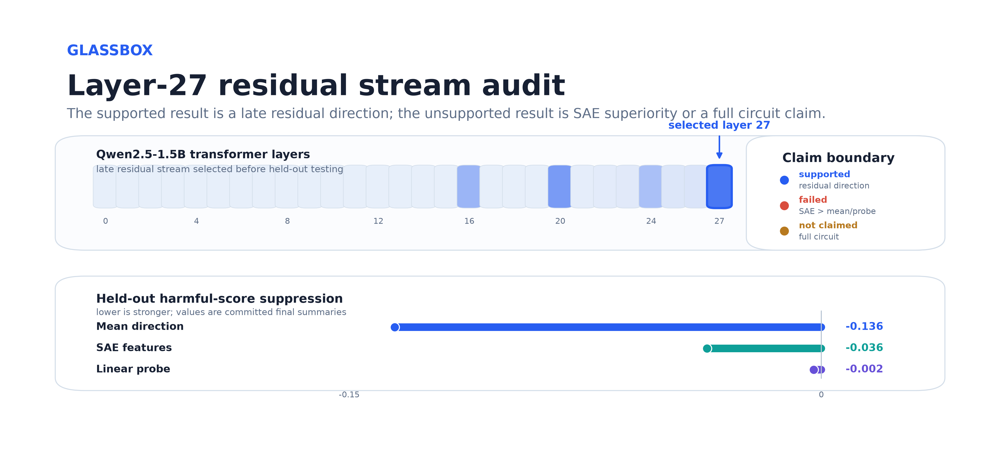
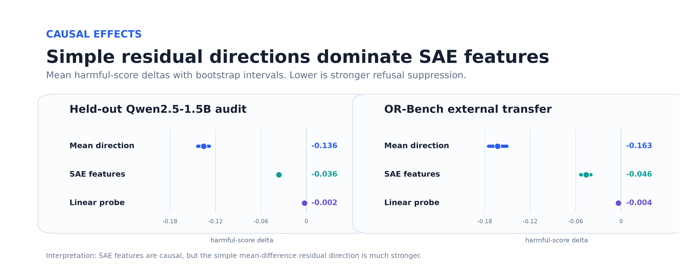
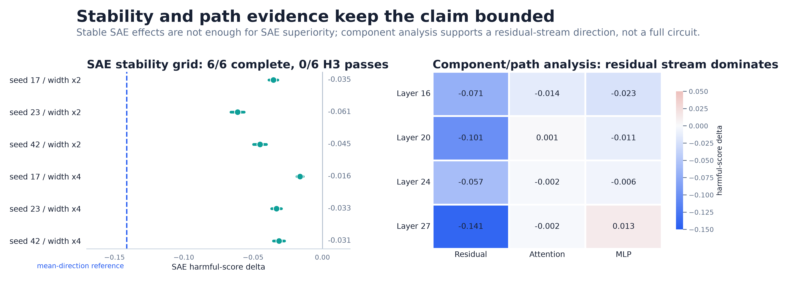

# Glassbox

[](https://github.com/HassanHassnain/glassbox-audit/actions/workflows/ci.yml)

**A held-out causal activation audit of refusal behavior in Qwen instruction models.**

Glassbox asks a narrow mechanistic-interpretability question: do sparse autoencoder features explain refusal behavior better than simple activation directions? The answer from this release is useful precisely because it is not flattering to the method.

> **Final claim:** Glassbox found a robust late residual-stream refusal-relevant direction in Qwen2.5-1.5B, with partial Qwen2.5-3B replication and OR-Bench external causal transfer. It did **not** confirm a full circuit. SAE features beat matched random-SAE controls but did **not** beat mean/probe baselines under held-out preregistered criteria.



## Why This Repository Exists

Most interpretability demos stop at correlation, cherry-picked steering, or a single attractive feature. Glassbox is structured as an adjudication harness: train-only discovery, validation-only threshold/scale selection, held-out causal tests, explicit baselines, random controls, negative-result reporting, and clean-room reproducibility.

## Evidence Snapshot

| Evidence block | Status | Main readout |
|---|---|---|
| Qwen2.5-1.5B controlled audit | completed | layer 27; mean ablation `-0.136`; SAE ablation `-0.036` |
| SAE stability grid | completed | 6/6 fixed cells; 0/6 SAE-vs-mean/probe passes |
| OR-Bench external transfer | completed | SAE toxic refusal-rate delta `-0.12`; mean delta `-0.68` |
| Qwen2.5-3B replication | partial | late layer 35 effect; specificity failed |
| Component/path analysis | completed | residual effect strong; attention/MLP effects small or non-specific |
| Clean-room rerun | completed | reproduced layer, rates, deltas, and H3 failure within fixed tolerances |

## Result Figures

The main held-out and external causal tests point in the same direction: simple residual directions suppress the refusal score more strongly than SAE features.



The negative SAE result is stable across the fixed grid, and the component analysis supports a residual-stream direction rather than a circuit claim.



## What Failed

- SAE did not beat mean/probe baselines under the preregistered held-out criterion.
- Component/path evidence did not establish a circuit-level mechanism.
- Qwen2.5-3B did not meet the specificity bar.
- Gemma/Llama configs are recipes only; no non-Qwen replication is claimed.
- Final real-model artifacts use contrastive log-probability scoring, not generated-answer judging.

## Quickstart

```bash
python3 -m venv .venv
source .venv/bin/activate
pip install -e ".[dev]"
make validate
make report
make release-check
```

`make validate` runs unit tests, Ruff, `compileall`, and the deterministic CPU toy audit. It does not require GPUs or model weights.

## Reproduce The Real-Model Audit

```bash
pip install -e ".[dev,accelerate,data]"
CUDA_VISIBLE_DEVICES=0 make reproduce-cleanroom
```

The real-model path regenerates the controlled 1,000-pair corpus and writes generated artifacts under `artifacts/`, which is intentionally ignored by git. External OR-Bench transfer is separate:

```bash
CUDA_VISIBLE_DEVICES=0 make reproduce-external
```

Expected hardware: a CUDA GPU with enough memory for Qwen2.5-1.5B plus activation collection. GitHub Actions intentionally runs CPU-safe checks only.

## Repository Map

```text
configs/                 public experiment recipes and unrun replication recipes
data/fixtures/           tiny committed fixtures for tests and toy runs
docs/paper.md            compact paper-style writeup
docs/release-report.md   methods, results, limitations, artifacts, reviewer Q&A
results/                 compact machine-readable evidence summaries
scripts/                 smoke, reproduction, report, and release-audit commands
src/glassbox_audit/      source package
tests/                   unit tests and CPU toy-pipeline checks
```

## Machine-Readable Evidence

The public summaries are deliberately stable and non-phase-named:

- `results/final/claim_summary.json`
- `results/final/qwen2_5_1_5b_audit.json`
- `results/final/reproducibility.json`
- `results/final/statistical_tests.json`
- `results/sae-stability/stability_grid.json`
- `results/external-causal/or_bench_qwen15b_1000_summary.json`
- `results/component-path/component_path_summary.json`
- `results/cross-model/qwen2_5_3b_replication.json`

Full tensors, checkpoints, generated prompt outputs, model caches, and regenerated datasets are excluded from git.

## Docs

Read [`docs/paper.md`](docs/paper.md) for the concise research writeup and [`docs/release-report.md`](docs/release-report.md) for methodology, result interpretation, reproducibility, limitations, and artifact policy.

## Citation

Use `CITATION.cff`, and cite the exact repository revision plus the model/data manifests for any reproduced run.

## License

MIT
