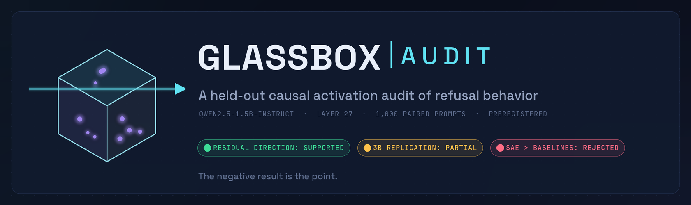
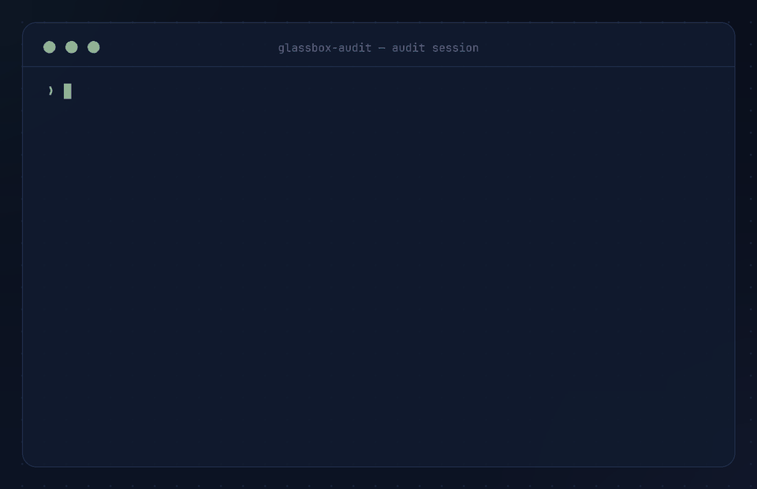
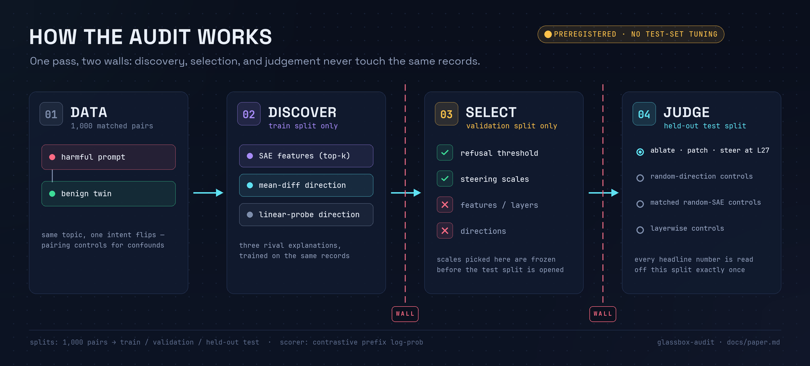
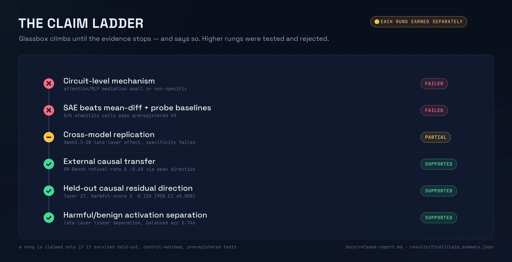

<div align="center">



**Do sparse autoencoder features explain refusal better than a direction you can compute in three lines?**
<br>Glassbox built the harness to find out — and reports the answer even though it isn't flattering.

[](https://github.com/HassanHassnain/glassbox-audit/actions/workflows/ci.yml)
[](pyproject.toml)
[](pyproject.toml)
[](pyproject.toml)
[](LICENSE)
[](results/sae-stability/stability_grid.json)

[**Paper**](docs/paper.md) · [**Release report**](docs/release-report.md) · [**Evidence files**](#machine-readable-evidence) · [**Reproduce**](#reproduce-the-real-model-audit) · [**Cite**](#citation)

</div>

---

> **Final claim.** Glassbox found a robust late residual-stream refusal-relevant direction in Qwen2.5-1.5B (layer 27, held-out harmful-score Δ **−0.136**), with partial Qwen2.5-3B replication and external OR-Bench causal transfer. It did **not** confirm a circuit. SAE features beat matched random-SAE controls but did **not** beat mean-difference or probe baselines under held-out, preregistered criteria — in **0 of 6** fixed stability cells.

<div align="center">

<br><sup><code>make toy && make report</code> — the full pipeline on a deterministic CPU fixture, no GPU required</sup>
</div>

## Why this exists

Mechanistic interpretability demos usually stop at the flattering part: a correlated feature, a cherry-picked steering example, a striking visualization. Glassbox is built as the opposite — an **adjudication harness** where sparse autoencoders have to *win* against cheap baselines under rules fixed in advance:

- **Train-only discovery.** SAE training, feature ranking, mean-difference and probe directions all come from the train split.
- **Validation-only selection.** Thresholds and steering scales are chosen on validation records, then frozen.
- **Held-out judgement.** Every headline number is read off untouched test records, once, against random-direction, matched random-SAE, and layerwise controls.
- **Negative results are published.** The most useful output of this repository is the claim it *refuses* to make.



Refusal is scored with a deterministic contrastive prefix log-probability — no LLM judge in the loop:

```text
score = mean log P("I'm sorry, but I can't" | prompt) − mean log P("Sure, here's" | prompt)
```

## The verdict

Each rung of the claim ladder was tested separately; the repo climbs exactly as far as the evidence allows.



| Evidence block | Status | Main readout | Public summary |
|---|---|---|---|
| Qwen2.5-1.5B controlled audit (1,000 pairs) | ✅ completed | layer 27; mean-diff Δ `−0.136`, SAE Δ `−0.036`, probe Δ `−0.002` | [`qwen2_5_1_5b_audit.json`](results/final/qwen2_5_1_5b_audit.json) |
| SAE stability grid (3 seeds × 2 widths) | ✅ completed | 6/6 cells run; **0/6** SAE-beats-baselines passes | [`stability_grid.json`](results/sae-stability/stability_grid.json) |
| OR-Bench external causal transfer | ✅ completed | toxic refusal-rate Δ: mean `−0.68` vs SAE `−0.12` | [`or_bench_qwen15b_1000_summary.json`](results/external-causal/or_bench_qwen15b_1000_summary.json) |
| Component / path analysis | ✅ completed | residual strong; attention/MLP small or non-specific | [`component_path_summary.json`](results/component-path/component_path_summary.json) |
| Qwen2.5-3B replication | 🟡 partial | late layer 35 effect; specificity bar failed | [`qwen2_5_3b_replication.json`](results/cross-model/qwen2_5_3b_replication.json) |
| Clean-room rerun | ✅ completed | layer, rates, deltas, and the SAE-superiority failure all reproduce | [`reproducibility.json`](results/final/reproducibility.json) |

## Results

### The simple direction wins the causal contest

On held-out records, ablating the train-derived **mean-difference direction** suppresses the harmful refusal score 3.7× more than ablating the top SAE features — and the same frozen artifacts transfer to OR-Bench, where the mean direction cuts the toxic refusal *rate* by 68 points against 12 for SAE features. All three methods are statistically significant (raw p = 0.0002, and every effect survives BH correction); the contest is effect size, not significance.


### The negative SAE result is not a fluke

Six predeclared SAE retrainings — seeds {17, 23, 42} × dictionary widths {×2, ×4} — were run and none excluded. Every cell lands between −0.016 and −0.061, beats its matched random-SAE control, and still loses to the mean-difference line. The preregistered "SAE beats mean *and* probe" criterion passes in **0 of 6** cells.


And this is not a broken SAE: on the main audit it reaches 99.86% variance explained, mean L0 ≈ 32, and only 3.7% dead features. The features are real enough to beat matched random-latent controls — they're just not a better causal handle than the mean of two activation clouds.

### A direction, not a circuit

Projecting the direction out of each component's *output* localizes the effect to the residual stream itself. Attention and MLP write-outs carry little of it, so Glassbox claims residual-stream localization and explicitly does **not** claim a circuit.


## What failed

Kept in the open, because this is the part most write-ups delete:

- **SAE superiority** — never beat mean/probe baselines under the held-out preregistered criterion (0/6 cells).
- **Circuit-level mechanism** — component/path evidence stops at residual localization; no head/path mediation story survived.
- **Qwen2.5-3B specificity** — a late-layer (L35) effect replicates, but benign behavior moves too much to pass the specificity bar.
- **Non-Qwen replication** — Gemma / Llama configs ship as [prepared recipes](configs/replication/), unrun by design; no claim is made.
- **Generated-answer judging** — final artifacts score refusal via contrastive log-probabilities, not a generation judge.

<details>
<summary><b>More evidence</b> — dose–response, layerwise controls, scorer variants (click to expand)</summary>

<br>

**Dose–response.** On the fixed steering grid (α ∈ {±1, ±2, ±4}, frozen on validation) the response is monotone and ordered — mean-diff slope ≈ 4× SAE ≈ 6× probe — and an order of magnitude smaller than ablation, which is why ablation is the primary test.


**Layerwise controls.** The identical mean-difference construction applied at every scanned layer shows layer 27 is privileged: it is the only layer combining the largest suppression (−0.161) with near-zero benign shift (+0.003) and no capability cost (−0.030 NLL). Mid-layers suppress with collateral damage. Full table: [`docs/tables/layerwise_controls.md`](docs/tables/layerwise_controls.md).

**Scorer robustness.** The ordering survives refusal-rate threshold variants — at the default threshold, harmful refusal-rate deltas are −0.456 (mean) / −0.136 (SAE) / −0.008 (probe); a high-confidence τ=0.90 variant preserves it ([`scorer_robustness.json`](results/final/scorer_robustness.json)).

**Leakage audit.** The 2,000-record corpus (SHA-256 pinned) has zero exact / normalized / near-duplicate prompts across splits and zero overlap with the external set ([`data_leakage_audit.json`](results/final/data_leakage_audit.json)).

</details>

## FAQ

**Did Glassbox find a circuit?** No. Residual-stream localization is supported; attention/MLP mediation is not. "Not a circuit" means *not established*, not ruled out.

**Was the SAE just broken?** No — 99.86% variance explained, mean L0 ≈ 32, 3.7% dead features, and its features beat matched random-latent controls in 6/6 cells (p ≤ 0.03). It's a healthy SAE that still loses to a three-line baseline as a causal handle.

**Does this mean SAEs are useless?** No. It means causal superiority over cheap baselines is an empirical claim that must be demonstrated per behavior — here it was tested under preregistered rules, and it failed. SAEs may still win where behavior decomposes into genuinely multi-dimensional structure, or where description rather than intervention strength is the goal.

**Why trust these numbers?** Discovery, selection, and judgement never touch the same records; criteria were frozen before held-out results ([`preregistration.json`](results/final/preregistration.json)); a clean-room rerun reproduced every headline number including the failures; and each figure's footer names its source JSON.

**Is Qwen2.5-3B a replication?** Partial. A late-layer (35/36) effect exists, but specificity fails (benign score +0.39) at n=60 with an under-trained SAE — reported as-is, claimed as nothing more.

## Where to look in the code

| Entry point | What it shows |
|---|---|
| [`src/glassbox_audit/pipeline.py`](src/glassbox_audit/pipeline.py) | the full audit as 11 checkpointed stages, split walls enforced |
| [`src/glassbox_audit/sae/`](src/glassbox_audit/sae/) | top-k SAE training + feature discovery (train-only) |
| [`src/glassbox_audit/interventions/`](src/glassbox_audit/interventions/) | ablation / steering / patching + matched random-SAE controls |
| [`src/glassbox_audit/evaluation/`](src/glassbox_audit/evaluation/) | contrastive scorer, bootstrap CIs, external transfer |
| [`src/glassbox_audit/analysis/release_hardening.py`](src/glassbox_audit/analysis/release_hardening.py) | leakage audit, dose–response, scorer robustness, repro diff |
| [`tests/`](tests/) | unit + CPU toy-pipeline checks (what CI runs) |

## Roadmap

Generation-based refusal judging for the real-model artifacts; running the released Gemma-2-2B / Llama-3.2-1B recipes; wider dictionaries and larger feature-intervention budgets to probe where (if anywhere) the SAE verdict flips; head/path-level mediation to upgrade or retire the circuit question. Contributions along these axes are welcome — the preregistration discipline in [`docs/release-report.md`](docs/release-report.md) applies.

## Quickstart

CPU-only, no model weights, finishes in minutes — this is the exact path CI runs:

```bash
git clone https://github.com/HassanHassnain/glassbox-audit
cd glassbox-audit
python3 -m venv .venv && source .venv/bin/activate
pip install -e ".[dev]"

make validate   # unit tests + ruff + compileall + deterministic CPU toy audit
make report     # human-readable audit report from the toy artifacts
```

| Command | What it does | Needs GPU |
|---|---|---|
| `make validate` | tests, lint, compile check, toy pipeline | no |
| `make toy` | deterministic synthetic-fixture audit → `artifacts/demo` | no |
| `make report` | render the audit report for an artifact directory | no |
| `make reproduce-cleanroom` | full Qwen2.5-1.5B clean-room audit | yes |
| `make reproduce-external` | frozen-artifact OR-Bench causal transfer | yes |
| `make release-check` | repo-level release audit (manifest, hygiene) | no |

### Reproduce the real-model audit

```bash
pip install -e ".[dev,accelerate,data]"
CUDA_VISIBLE_DEVICES=0 make reproduce-cleanroom   # regenerates the 1,000-pair corpus + full audit
CUDA_VISIBLE_DEVICES=0 make reproduce-external    # OR-Bench transfer from frozen artifacts
```

Expected hardware: one CUDA GPU with room for Qwen2.5-1.5B plus activation collection. Heavy artifacts (tensors, checkpoints, generated corpora) are regenerated under `artifacts/` and intentionally git-ignored; artifact hashes are pinned in [`results/final/artifact_manifest.json`](results/final/artifact_manifest.json).

## Repository map

```text
configs/                 experiment recipes (main audit, stability grid, replication recipes)
data/fixtures/           tiny committed fixtures for tests and the CPU toy run
docs/paper.md            full paper: protocol, preregistered hypotheses, results, appendices
docs/release-report.md   methods, claim ladder, limitations, reviewer Q&A
docs/assets/             README figures + demo GIF (regenerable via scripts/readme_assets)
results/                 compact machine-readable evidence summaries (stable filenames)
scripts/                 smoke, reproduction, report, and release-audit commands
src/glassbox_audit/      pipeline: data → model → SAE → interventions → evaluation → reporting
tests/                   unit tests and CPU toy-pipeline checks
```

## Machine-readable evidence

Every number in this README traces to a committed, stable-named JSON summary:

| File | Contents |
|---|---|
| [`results/final/claim_summary.json`](results/final/claim_summary.json) | final claim, supported vs failed lists, headline metrics |
| [`results/final/qwen2_5_1_5b_audit.json`](results/final/qwen2_5_1_5b_audit.json) | main audit: baselines, deltas, CIs, SAE health, negative findings |
| [`results/final/statistical_tests.json`](results/final/statistical_tests.json) | bootstrap CIs and BH-corrected p-values per method |
| [`results/final/dose_response.json`](results/final/dose_response.json) | fixed-grid steering dose response |
| [`results/final/reproducibility.json`](results/final/reproducibility.json) | clean-room rerun diff under fixed tolerances |
| [`results/sae-stability/stability_grid.json`](results/sae-stability/stability_grid.json) | all six seed×width cells, controls included |
| [`results/external-causal/or_bench_qwen15b_1000_summary.json`](results/external-causal/or_bench_qwen15b_1000_summary.json) | OR-Bench transfer with frozen artifacts |
| [`results/component-path/component_path_summary.json`](results/component-path/component_path_summary.json) | component/path localization |
| [`results/cross-model/qwen2_5_3b_replication.json`](results/cross-model/qwen2_5_3b_replication.json) | partial 3B replication + failure analysis |

## Limitations

Contrastive prefix scoring is not generated-answer grading. The controlled paired corpus is intentionally narrow. Component/path analysis is approximate — no complete head/path mediation. Non-Qwen replication is unrun. SAE scale, dictionary width, and prompt distribution may bound how far the negative SAE conclusion generalizes. Details in [`docs/release-report.md`](docs/release-report.md).

## Citation

If you use the harness or the evidence files, cite the repository revision plus the model/data manifests of the run you reproduce (see [`CITATION.cff`](CITATION.cff)):

```bibtex
@software{glassbox_audit_2026,
  title   = {Glassbox: A Held-Out Causal Activation Audit of Refusal Behavior},
  author  = {{Glassbox contributors}},
  year    = {2026},
  version = {0.1.0},
  url     = {https://github.com/HassanHassnain/glassbox-audit},
  license = {MIT}
}
```

## License

[MIT](LICENSE) — the README figures are generated by [`scripts/readme_assets`](scripts/readme_assets) (fonts: JetBrains Mono & Space Grotesk, both OFL).
