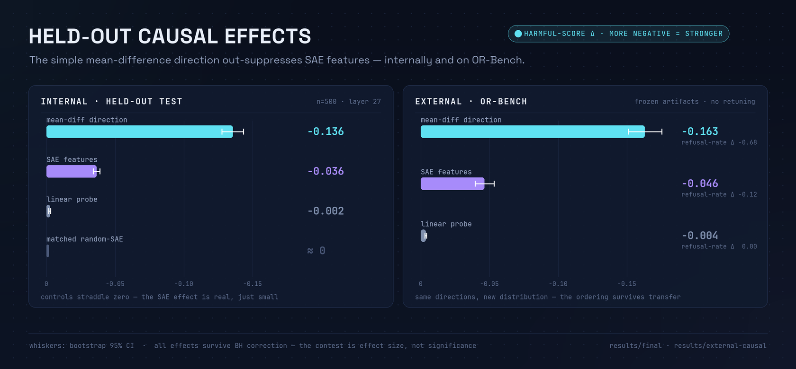
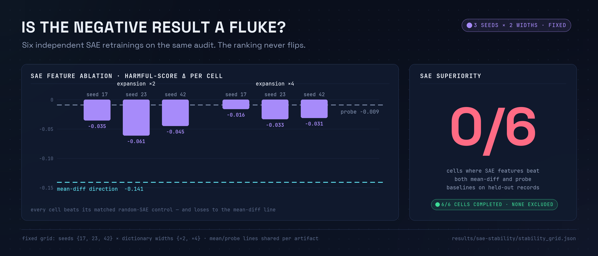
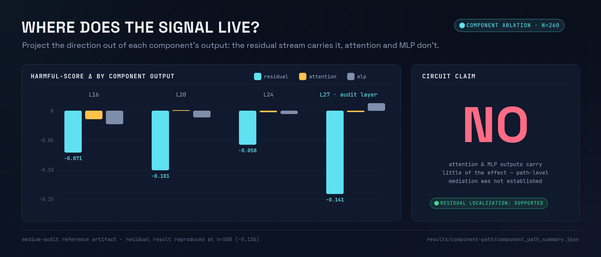
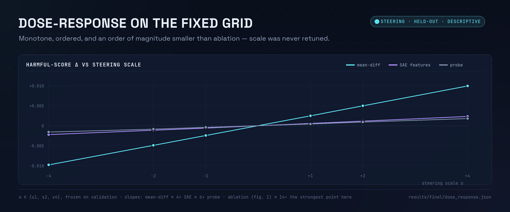

# Do Sparse Autoencoder Features Explain Refusal? A Preregistered, Held-Out Causal Audit

**Glassbox contributors**
*Code, evidence files, and reproduction commands: [github.com/HassanHassnain/glassbox-audit](https://github.com/HassanHassnain/glassbox-audit)*

## Abstract

Sparse autoencoders (SAEs) are widely proposed as the unit of analysis for mechanistic interpretability, yet causal evaluations against simple baselines remain rare. We present **Glassbox**, a preregistered auditing protocol that asks whether SAE features provide a better *causal* account of refusal behavior than directions computable in closed form. On a controlled 1,000-pair harmful/benign corpus for Qwen2.5-1.5B-Instruct, all discovery is confined to a train split, all selection to a validation split, and all headline effects are measured once on held-out records against random-direction, matched random-SAE, and layerwise controls. We find a robust layer-27 residual-stream direction: mean-difference ablation shifts the held-out harmful refusal score by **−0.136** (95% CI [−0.143, −0.128]) and cuts the harmful refusal rate from 0.64 to 0.18 with negligible benign and capability cost, satisfying our preregistered robustness criterion. The effect transfers zero-shot to OR-Bench (toxic refusal-rate Δ **−0.68**). SAE feature ablation is real — it beats matched random-SAE controls in 6/6 predeclared retraining cells — but it never beats the mean-difference or probe baselines (**0/6** cells; paired difference −0.141 [−0.158, −0.124]), and component-level analysis supports residual localization rather than an attention/MLP circuit. A clean-room rerun reproduces all headline numbers, including the negative ones. We argue that audits of this form — preregistered, held-out, baseline-anchored — should gate causal claims made on behalf of SAE features, and we release the full harness and machine-readable evidence.

## 1 Introduction

Mechanistic interpretability aspires to explain model behavior in terms of internal structure. Sparse autoencoders have become the field's default microscope: trained to reconstruct residual-stream activations under a sparsity constraint, they yield dictionaries of features that are often strikingly interpretable [Bricken et al., 2023; Cunningham et al., 2024; Templeton et al., 2024; Gao et al., 2024]. An implicit claim rides along with this program: that SAE features are not merely legible but are *better handles on the model's mechanisms* than cheaper alternatives.

That claim is causal, and it is testable. For refusal — the safety behavior in which a model declines harmful requests — prior work has shown that a *single direction*, computed as a difference of means between harmful and harmless activations, largely mediates the behavior [Arditi et al., 2024]. This sets up a sharp contest. If SAE features carve refusal at its joints, intervening on a handful of them should causally suppress refusal at least as well as the one-line mean-difference baseline, under evaluation rules that neither side can overfit.

Most interpretability evaluations do not enforce such rules. Features are selected, thresholds tuned, and steering scales chosen on the same data used to report effects; baselines are absent or weak; negative cells are silently dropped. These are exactly the failure modes that probing research spent years learning to control [Hewitt & Liang, 2019; Belinkov, 2022], and that recent benchmarking efforts have begun to surface for SAEs specifically [Wu et al., 2025; Karvonen et al., 2025].

**Glassbox** is an adjudication harness built to make the contest fair and the answer hard to fudge:

1. **A preregistered protocol for causal interpretability claims.** Hypotheses H1–H5, acceptance thresholds, the full stability grid, and the run order were frozen before held-out results were read (Section 4.5); the policy forbids retuning of layers, features, thresholds, scales, prompts, metrics, seeds, widths, or criteria afterward.
2. **A controlled, leakage-audited corpus.** 1,000 topic-matched harmful/benign prompt pairs with train/validation/test discipline and a released leakage audit: zero exact, normalized, or near-duplicate prompts across splits and zero overlap with the external evaluation set (Section 4.1).
3. **A baseline-anchored causal evaluation.** SAE feature interventions compete against mean-difference and linear-probe directions under identical selection budgets, with isotropic random directions, *matched random-SAE latent* controls, and layerwise controls (Section 4.4).
4. **A negative result, published with its supporting evidence.** SAE features beat their matched random controls in every cell yet lose to the mean-difference direction in every cell. We release all six predeclared retraining cells, the clean-room reproduction, and compact machine-readable summaries for every number in this paper.

Our headline findings: (i) refusal in Qwen2.5-1.5B-Instruct is causally mediated by a late residual-stream direction (layer 27 of 28) that survives held-out testing, layerwise controls, threshold variants, and external transfer; (ii) top-k SAE features trained on the same activations, while causally real, recover only a fraction of that effect (−0.036 vs −0.136) at every seed and dictionary width tested; (iii) the effect is a *direction*, not an identified circuit — attention and MLP output ablations are small or non-specific; and (iv) a partial cross-model replication on Qwen2.5-3B finds a late-layer effect that fails our specificity bar. We take (ii) not as evidence that SAEs are useless, but as evidence that causal superiority over strong cheap baselines must be demonstrated, not assumed.

## 2 Related Work

**Refusal directions and activation steering.** Arditi et al. [2024] showed that refusal across many chat models is mediated by a single difference-of-means direction, ablatable to bypass refusal; our mean-difference baseline is their construction under stricter selection discipline. Steering by adding activation vectors originates with activation addition [Turner et al., 2023] and contrastive activation addition [Panickssery et al., 2024], and representation-level control is systematized in representation engineering [Zou et al., 2023]. We use steering only as a secondary readout; our primary tests are ablation and projection patching.

**Sparse autoencoders.** Dictionary learning on activations [Bricken et al., 2023; Cunningham et al., 2024] scaled to frontier models [Templeton et al., 2024] and to improved architectures — top-k [Gao et al., 2024], gated and JumpReLU variants [Rajamanoharan et al., 2024]. Sparse feature circuits [Marks et al., 2024] build causal subnetworks from SAE features. Our audit uses top-k SAEs matched to this lineage (k=32) and asks the prior question: do the features beat the direction they are meant to refine?

**Evaluating interpretability causally.** Causal tracing and activation patching localize computation [Meng et al., 2022]; causal scrubbing [Chan et al., 2022] and automated circuit discovery [Conmy et al., 2023; Syed et al., 2023] formalize faithfulness tests. Our component/path analysis follows this tradition but reports its own failure to reach circuit-level evidence (H4).

**Baselines and control tasks.** Control tasks for probes [Hewitt & Liang, 2019] and the probing literature's selectivity concerns [Belinkov, 2022] motivate our matched random-SAE controls, which preserve the encode–zero–decode intervention mechanics while randomizing feature identity. AxBench [Wu et al., 2025] found that simple baselines outperform SAE steering on concept control; SAEBench [Karvonen et al., 2025] standardizes SAE quality metrics. Glassbox complements both with a preregistered, held-out, single-behavior *causal* audit in which selection itself is walled off. Open problems in the field, including the scarcity of adversarially-robust evaluation, are catalogued by Sharkey et al. [2025].

**Over-refusal evaluation.** Our external transfer set derives from OR-Bench [Cui et al., 2024], whose toxic and hard-benign subsets let us measure both refusal suppression and over-refusal side-effects under frozen interventions.

## 3 Preliminaries

Let $f$ be a decoder-only transformer with layers $1..L$ and residual stream $h^{(\ell)}(x) \in \mathbb{R}^d$ (mean-pooled over prompt tokens unless stated). A prompt corpus $\mathcal{D} = \{(x_i, y_i, g_i, s_i)\}$ carries a harmfulness label $y_i \in \{0,1\}$, a pair identifier $g_i$ linking each harmful prompt to a topic-matched benign twin, and a split $s_i \in \{\text{train}, \text{val}, \text{test}\}$ assigned at the pair level (both members of a pair share a split).

**Refusal score.** Refusal is scored deterministically by contrastive prefix log-probability:

$$r(x) \;=\; \tfrac{1}{|R|}\log P_f(R \mid x) \;-\; \tfrac{1}{|A|}\log P_f(A \mid x),$$

with refusal prefix $R$ = "I'm sorry, but I can't" and answer prefix $A$ = "Sure, here's", token-length normalized. A refusal *rate* thresholds $r(x)$ at $\tau$ selected on validation only (balanced-accuracy criterion; $\tau = 0.847$ for the main audit). No LLM judge appears anywhere in the loop, making the scorer exactly reproducible; Section 6.6 tests robustness to threshold variants.

**Interventions.** For a unit direction $v$, *directional ablation* replaces $h \leftarrow h - (h^\top v)\,v$ at the target layer for all positions; *steering* adds $\alpha v$ with scale $\alpha$ chosen on validation; *projection patching* moves the component along $v$ toward the benign class mean. For a set $S$ of SAE latents, *feature ablation* encodes $h$, zeroes the latents in $S$, and decodes — so SAE interventions act through the SAE's own reconstruction pathway.

**Metrics.** We report held-out deltas relative to the unintervened model: mean harmful refusal-score delta $\Delta_H$ (primary; negative = suppression), mean benign score delta $\Delta_B$ (specificity), capability cost as next-token NLL delta $\Delta_C$ on held-out text, refusal-rate deltas at fixed $\tau$, and bootstrap 95% CIs (3,000 resamples). A specificity-adjusted utility combining these is reported for descriptive comparison only.

## 4 The Glassbox Audit Protocol

### 4.1 Controlled corpus and leakage audit

The corpus contains 2,000 records: 1,000 harmful prompts, each paired with a benign refusal-sensitive twin on the same topic (same surface domain, one intent flip), so that harmful/benign contrasts are not confounded by topic. Pairs are split train/validation/test with the pair as the atomic unit. The released leakage audit (`results/final/data_leakage_audit.json`, corpus SHA-256 pinned) reports: zero exact-duplicate prompts across splits, zero normalized duplicates, zero near-duplicates, zero harmful/benign prompt-text overlap within pairs, zero family overlap across splits, and zero overlap between the controlled corpus and the external OR-Bench evaluation files.

### 4.2 Discovery (train split only)

From train activations at each scanned layer $\ell \in \{4, 8, 12, 16, 20, 24, 27\}$ we compute a localization score and fix the **target layer** as its argmax (layer 27). On the target layer we then construct three rival explanations:

- **SAE features.** A top-k SAE (expansion ×2 → 3,072 latents; $k = 32$; 250 epochs; batch 512; lr 5·10⁻⁴; ℓ1 10⁻⁴) trained on 47,645 train-prompt activation vectors (48 tokens/prompt, subsampled from a 64k cap, seed 17). The 5 most class-separating latents (by effect size on train) form the intervention set, and their decoder combination defines an SAE direction for patching.
- **Mean-difference direction.** $v_{\text{mean}} \propto \bar h_{\text{harmful}} - \bar h_{\text{benign}}$ on train activations.
- **Linear-probe direction.** The weight vector of an ℓ2-regularized logistic probe trained on the same activations.

All directions are sign-oriented on train and unit-normalized. Nothing in discovery sees validation or test records.

### 4.3 Selection (validation split only)

Validation records select exactly two things: the refusal-rate threshold $\tau$ and the steering scale per method from the fixed grid $\{\pm 1, \pm 2, \pm 4\}$. Layers, features, directions, and all evaluation criteria are *not* selectable here. Selected values are frozen before any test record is scored.

### 4.4 Judgement (held-out test split, once) and controls

On 500 held-out records we run: SAE feature ablation, SAE steering, SAE-direction projection patching, mean-difference ablation and steering, probe ablation and steering, and the control battery:

- **Isotropic random directions** (32 draws, ablation at the control scale −4) bound generic-perturbation effects.
- **Matched random-SAE controls** replicate the SAE intervention *mechanics* exactly — same trained SAE, encoder bias zeroed, literal encode–zero-selected-latent–decode, same activation centering — but zero *random* latent sets instead of the selected ones (32–48 draws per artifact). This isolates feature identity from intervention plumbing, in the spirit of control tasks for probes.
- **Layerwise controls** apply the mean-difference construction independently at every scanned layer, testing whether layer 27 is privileged or any late layer would do.

### 4.5 Preregistered hypotheses

The following criteria were frozen (2026-06-19), with a fixed run order and an explicit no-retuning policy, before held-out results were read (`results/final/preregistration.json`):

| ID | Hypothesis | Preregistered acceptance criterion |
|---|---|---|
| **H1** | Internal residual robustness | held-out $\Delta_H \le -0.08$ with CI upper bound < 0; $\lvert\Delta_B\rvert \le 0.05$; $\Delta_C \le 0.05$ |
| **H2** | SAE stability *and superiority* | 6 predeclared cells (seeds 17/23/42 × widths ×2/×4), no exclusions; ≥ 4 cells where SAE beats **both** mean and probe on held-out records, with random-SAE empirical $p \le 0.05$ |
| **H3** | External causal transfer | frozen artifacts, **no** rediscovery or retuning on external data; $\Delta_C \le 0.05$; compared against random controls |
| **H4** | Component/path mechanism | necessity, sufficiency, and specificity with controls and held-out replication |
| **H5** | Cross-model replication | attempted only where weights are available; unrun models reported as unrun |

(For provenance: the per-cell superiority criterion of H2 is recorded as `h3_preregistered_pass` inside the stability-grid summary; the hypothesis numbering above follows the preregistration file.)

## 5 Experimental Setup

**Models.** Qwen/Qwen2.5-1.5B-Instruct (28 layers, $d = 1536$, fp16) for the main audit; Qwen/Qwen2.5-3B-Instruct (36 layers, $d = 2048$) for H5. Gemma-2-2B-it and Llama-3.2-1B-Instruct configs are released as unrun replication recipes per H5's no-fabrication clause.

**SAE quality (main audit).** Variance explained 0.9986; mean ℓ0 = 32.0; 3.7% dead features; feature density 0.0104; 15.5 training samples per feature. The negative result below is not attributable to a degenerate SAE.

**Statistics.** Bootstrap 95% CIs (3,000 resamples) for all deltas; Benjamini–Hochberg correction across the registered test families [Benjamini & Hochberg, 1995]; empirical one-sided $p$ for SAE-vs-matched-random-control comparisons.

**Compute.** All real-model runs fit on a single consumer-class CUDA GPU; the CI pipeline (unit tests, lint, a deterministic CPU toy audit, and a release audit) requires no GPU.

## 6 Results

### 6.1 H1 — A robust held-out residual direction (supported)

Table 1 and Figure 1 give the held-out causal effects at layer 27 (n = 500).

**Table 1 — Held-out causal effects, Qwen2.5-1.5B-Instruct, layer 27.** Refusal-rate deltas at the validation-selected threshold $\tau = 0.847$; baseline harmful refusal rate 0.64, benign over-refusal rate 0.148.

| Intervention | $\Delta_H$ (95% CI) | $\Delta_B$ | $\Delta_C$ (NLL) | harmful refusal-rate Δ |
|---|---|---:|---:|---:|
| Mean-difference ablation | **−0.136** [−0.143, −0.128] | −0.015 | −0.016 | **−0.456** (0.64 → 0.18) |
| SAE feature ablation (top-5) | −0.036 [−0.039, −0.034] | −0.036 | +0.002 | −0.136 (0.64 → 0.50) |
| Linear-probe ablation | −0.002 [−0.003, −0.002] | — | — | −0.008 |
| Isotropic random directions (32) | ≈ 0 | — | — | — |
| Matched random-SAE controls | straddle 0 (e.g. [−0.0014, +0.0005], n=32) | — | — | — |

H1 passes all four preregistered conditions: $\Delta_H = -0.136 \le -0.08$; CI upper bound −0.128 < 0; $\lvert\Delta_B\rvert = 0.015 \le 0.05$; $\Delta_C = -0.016 \le 0.05$. All non-control effects survive BH correction (raw $p = 2\times10^{-4}$).

**Layerwise controls: layer 27 is privileged.** Applying the identical mean-difference construction at every scanned layer (Table 2) shows mid-layers producing sizeable harmful-score shifts *with* specificity or capability damage; only layer 27 combines the largest suppression with near-zero benign shift and negative NLL cost.

**Table 2 — Layerwise mean-difference ablation controls.**

| Layer | $\Delta_H$ (95% CI) | $\Delta_B$ | $\Delta_C$ |
|---:|---|---:|---:|
| 4 | −0.001 [−0.001, +0.000] | +0.003 | −0.081 |
| 8 | −0.003 [−0.004, −0.002] | −0.010 | +0.112 |
| 12 | +0.005 [+0.003, +0.006] | +0.024 | +0.120 |
| 16 | −0.101 [−0.116, −0.086] | −0.039 | +0.191 |
| 20 | −0.108 [−0.120, −0.095] | +0.039 | +0.073 |
| 24 | −0.079 [−0.090, −0.068] | +0.068 | +0.161 |
| **27** | **−0.161 [−0.180, −0.141]** | **+0.003** | **−0.030** |

*Figure 1 — Held-out (internal, n=500) and external (OR-Bench) causal effects. The mean-difference direction dominates at both sites; controls straddle zero.*

### 6.2 H2 — SAE features do not beat simple baselines (failed, 0/6)

The predeclared grid retrains the SAE under seeds {17, 23, 42} × expansion factors {×2, ×4} with everything else frozen. All six cells completed; none were excluded.

**Table 3 — SAE stability grid.** Per-cell held-out SAE feature-ablation $\Delta_H$, the shared mean/probe references, the matched random-SAE control range, and the preregistered superiority verdict.

| Cell | SAE $\Delta_H$ | Mean ref. | Probe ref. | Random-SAE range | beats mean? | beats probe? | pass |
|---|---:|---:|---:|---|---|---|---|
| seed17 ×2 | −0.035 | −0.141 | −0.009 | [−0.011, +0.009] | ✗ | ✓ | ✗ |
| seed23 ×2 | −0.061 | −0.141 | −0.009 | [−0.003, +0.005] | ✗ | ✓ | ✗ |
| seed42 ×2 | −0.045 | −0.141 | −0.009 | [−0.004, +0.008] | ✗ | ✓ | ✗ |
| seed17 ×4 | −0.016 | −0.141 | −0.009 | [−0.011, +0.009] | ✗ | ✓ | ✗ |
| seed23 ×4 | −0.033 | −0.141 | −0.009 | [−0.003, +0.005] | ✗ | ✓ | ✗ |
| seed42 ×4 | −0.031 | −0.141 | −0.009 | [−0.004, +0.007] | ✗ | ✓ | ✗ |

Three facts hold simultaneously in every cell: (i) the SAE effect is *real* — it clears its matched random-SAE control (empirical $p \le 0.03$); (ii) it beats the probe; (iii) it loses to the mean-difference direction by a wide margin. The direct paired comparison on held-out records gives mean-minus-SAE $\Delta_H = $ **−0.141 [−0.158, −0.124]**. H2 required ≥ 4/6 superiority passes; the observed count is **0/6**. Two auxiliary negative findings sharpen this: SAE activation patching does not reduce the harmful score and incurs material NLL cost.

*Figure 2 — Six SAE retrainings; the ranking never flips.*

### 6.3 H3 — External causal transfer (supported; SAE still not superior)

We freeze every artifact from the internal audit — directions, features, scales, threshold — and evaluate on normalized OR-Bench toxic and hard-benign subsets (100 records per label; unpaired, hence reported separately). No rediscovery or retuning occurs. The baseline model over-refuses on this distribution (toxic refusal rate 0.96; hard-benign over-refusal 0.82).

**Table 4 — OR-Bench zero-shot causal transfer.**

| Intervention | $\Delta_H$ (95% CI) | toxic refusal-rate Δ | hard-benign over-refusal Δ | $\Delta_C$ |
|---|---|---:|---:|---:|
| Mean-difference ablation | −0.163 [−0.175, −0.151] | **−0.68** | −0.55 | −0.021 |
| SAE feature ablation | −0.046 [−0.053, −0.040] | −0.12 | — | — |
| Linear-probe ablation | −0.004 [−0.004, −0.003] | 0.00 | — | — |

The internal ordering (mean ≫ SAE ≫ probe) transfers unchanged; the capability constraint $\Delta_C \le 0.05$ holds. H3 is supported as an external-transfer claim about the residual direction — and simultaneously replicates the SAE inferiority out of distribution.

### 6.4 H4 — A direction, not a circuit (failed)

Projecting the direction out of each component's *output* (residual stream, attention block output, MLP output) at layers {16, 20, 24, 27} localizes the causal effect to the residual stream itself (Table 5; n = 260 reference artifact, residual result reproduced at n = 500 with $\Delta_H = -0.136$).

**Table 5 — Component-output ablation, harmful-score Δ.**

| Layer | Residual | Attention out | MLP out |
|---:|---:|---:|---:|
| 16 | −0.071 | −0.014 | −0.023 |
| 20 | −0.101 | +0.001 | −0.011 |
| 24 | −0.058 | −0.002 | −0.006 |
| 27 | **−0.141** | −0.002 | +0.013 |

Attention and MLP write-outs at the audited layer carry essentially none of the effect, and the analysis does not include head-level or path-level mediation. The preregistered H4 bundle (necessity + sufficiency + specificity + controls + held-out replication at the path level) is therefore *not met*, and the release records `confirmed_circuit: false`. Glassbox claims residual-stream localization only.

*Figure 3 — The signal lives in the residual stream; attention/MLP outputs are small or non-specific.*

### 6.5 H5 — Partial cross-model replication (Qwen2.5-3B)

On Qwen2.5-3B-Instruct (n = 60 held-out records; baseline harmful refusal rate 1.00, benign over-refusal 0.033), the layer scan again selects a late layer (35 of 36), and the strongest intervention is again mean-difference ablation ($\Delta_H = -0.090$). But specificity fails badly: the same intervention shifts the benign score by **+0.390** with an NLL cost of +0.164, and every method's specificity-adjusted utility is negative at the selected scales. Curiously, the *legacy* utility flag records SAE features as the least-bad method on this model (−0.0042 vs −0.0060 for mean-difference), and the 3B SAE again clears its matched random controls (effect −0.006 vs control range [−0.0003, +0.0002], $p = 0.024$, n = 40) — but the 3B SAE is visibly under-trained (45.7% dead features vs 3.7% at 1.5B), so we treat every 3B reading as provisional. H5 is reported as *partial, Qwen-family only*: a late-layer effect exists; the clean 1.5B specificity profile does not replicate at n = 60.

### 6.6 Robustness: dose–response, scorer variants, reproduction

**Dose–response.** On the fixed steering grid (descriptive; no retuning), harmful-score response is monotone and near-antisymmetric in scale for all methods, with the mean-difference slope ≈ 4× the SAE slope and ≈ 6× the probe slope at matched scales (Figure 4). Steering effects at these scales are an order of magnitude smaller than ablation effects, consistent with ablation being the right primary test for a mediation claim.

*Figure 4 — Fixed-grid steering dose–response (held-out). Monotone, ordered, and small relative to ablation.*

**Scorer robustness.** The headline ordering survives fixed score-threshold variants of the refusal-rate readout (`results/final/scorer_robustness.json`): at the default threshold, harmful refusal-rate deltas are −0.456 (mean), −0.136 (SAE), −0.008 (probe); a high-confidence variant ($\tau = 0.90$) preserves the ordering. Because final real-model artifacts store contrastive scores rather than generated text, keyword-based response scoring is unavailable without regeneration — a stated limitation, with scorer-disagreement rows released for manual review.

**Clean-room reproduction.** An independent rerun from documented commands reproduced the target layer, baseline rates (0.64 / 0.148), the mean-difference delta (−0.1356), the SAE delta, and the H2 failure within fixed tolerances declared in advance (`results/final/reproducibility.json`). The final claim is unchanged by reproduction.

## 7 Discussion

**Why does the mean beat the dictionary?** The mean-difference direction *is* the first moment of the class contrast; if refusal is encoded (at this site, at this scale) as a predominantly linear mean shift, then the optimal single-shot causal handle is essentially that shift. A top-k SAE decomposes the same activation space into thousands of sparse latents, distributing the class-relevant variance across many features; zeroing the top five captures only the portion of the shift those features span. On this reading, the SAE is not *wrong* — its selected features are causally real, beating matched random latents everywhere — it is *inefficient* as a causal handle for a behavior whose natural description is one direction. The failure of SAE activation patching (no suppression, material NLL cost) is consistent with reconstruction-pathway interventions degrading unrelated computation.

**What this does and does not indict.** Our result is a statement about *causal superiority for one behavior, one model family, one training recipe* — not about SAE interpretability at large. SAEs may still win where behaviors decompose into genuinely multi-dimensional structure, where feature-level *description* (not intervention strength) is the goal, or with dictionaries and feature-selection budgets beyond ours. What the result does indict is the practice of asserting mechanistic privilege for SAE features without running the cheap baseline under equal selection discipline. In our audit, every degree of freedom the SAE was allowed, the baseline was allowed too — and the baseline is three lines of NumPy.

**Auditing as a first-class deliverable.** The most transferable artifact here may be the protocol: preregister the claim ladder, wall off discovery/selection/judgement, match controls to intervention mechanics, publish every predeclared cell, and let the repository refuse the claims the evidence cannot carry. Each rung of our ladder — separation, held-out causal direction, external transfer, cross-model replication, SAE superiority, circuit — was tested and reported separately, and the release claims exactly the rungs that passed.

## 8 Limitations

The refusal scorer is a contrastive prefix log-probability, not generated-answer judging; regeneration-based grading is future work. The controlled corpus is topic-matched by construction and deliberately narrow; naturalistic breadth comes only from the (unpaired) OR-Bench transfer. Component analysis stops at component outputs — no head-level or path-level mediation, so "not a circuit" means *not established*, not *ruled out*. The 3B replication uses n = 60 and an under-trained SAE. Non-Qwen replication is unrun (recipes released). Finally, the negative H2 conclusion is bounded by our SAE recipe — top-k (k=32), expansions ×2/×4, ~48k activation samples, top-5 feature interventions — and could in principle reverse under substantially different dictionary training or feature-selection budgets; the harness exists to make such a reversal easy to demonstrate.

## 9 Broader Impact

This work analyzes how refusal is implemented, and directional ablation can partially bypass refusal in open-weight models — a capability already public [Arditi et al., 2024] and reproducible with the mean-difference baseline alone; we introduce no new attack surface beyond it. We release no jailbreak prompts, no generated harmful content, and no fine-tuned weights: evidence files contain aggregate scores only. The methodological contribution runs the other way — a discipline for *checking* safety-relevant mechanistic claims before they are relied upon, and for keeping negative results in the record. We believe standardized causal audits of interpretability claims are net-protective for the deployment of safety interventions built on those claims.

## 10 Reproducibility Statement

Everything needed to reproduce this paper ships in the repository. CPU path (no weights): `make validate` runs unit tests, lint, compile checks, and a deterministic toy audit; CI runs it on every commit. GPU paths: `make reproduce-cleanroom` regenerates the controlled corpus (SHA-256 pinned) and the full 1.5B audit; `make reproduce-external` runs the frozen-artifact OR-Bench transfer. Every table and figure in this paper is transcribed from committed, stable-named JSON evidence under `results/` (per-file map in the README); generated-artifact hashes are pinned in `results/final/artifact_manifest.json`; the preregistration freeze, run order, and no-retuning policy are in `results/final/preregistration.json`. Figures regenerate via `python scripts/readme_assets/generate_all.py`.

## References

- Arditi, A., Obeso, O., Syed, A., Paleka, D., Panickssery, N., Gurnee, W., Nanda, N. (2024). *Refusal in Language Models Is Mediated by a Single Direction.* arXiv preprint arXiv:2406.11717.
- Belinkov, Y. (2022). *Probing Classifiers: Promises, Shortcomings, and Advances.* Computational Linguistics, 48(1).
- Benjamini, Y., Hochberg, Y. (1995). *Controlling the False Discovery Rate.* JRSS-B, 57(1).
- Bricken, T., et al. (2023). *Towards Monosemanticity: Decomposing Language Models With Dictionary Learning.* Transformer Circuits Thread, Anthropic.
- Chan, L., et al. (2022). *Causal Scrubbing: A Method for Rigorously Testing Interpretability Hypotheses.* Alignment Forum.
- Conmy, A., Mavor-Parker, A., Lynch, A., Heimersheim, S., Garriga-Alonso, A. (2023). *Towards Automated Circuit Discovery for Mechanistic Interpretability.* NeurIPS 2023.
- Cui, J., Chiang, W.-L., Stoica, I., Hsieh, C.-J. (2024). *OR-Bench: An Over-Refusal Benchmark for Large Language Models.* arXiv preprint.
- Cunningham, H., Ewart, A., Riggs, L., Huben, R., Sharkey, L. (2024). *Sparse Autoencoders Find Highly Interpretable Features in Language Models.* ICLR 2024.
- Gao, L., la Tour, T. D., Tillman, H., et al. (2024). *Scaling and Evaluating Sparse Autoencoders.* arXiv preprint arXiv:2406.04093.
- Hewitt, J., Liang, P. (2019). *Designing and Interpreting Probes with Control Tasks.* EMNLP 2019.
- Karvonen, A., Rager, C., et al. (2025). *SAEBench: A Comprehensive Benchmark for Sparse Autoencoders.* arXiv preprint arXiv:2503.09532.
- Marks, S., Rager, C., Michaud, E., Belinkov, Y., Bau, D., Mueller, A. (2024). *Sparse Feature Circuits: Discovering and Editing Interpretable Causal Graphs in Language Models.* arXiv preprint.
- Meng, K., Bau, D., Andonian, A., Belinkov, Y. (2022). *Locating and Editing Factual Associations in GPT.* NeurIPS 2022.
- Panickssery, N., Gabrieli, N., Schulz, J., Tong, M., Hubinger, E., Turner, A. (2024). *Steering Llama 2 via Contrastive Activation Addition.* arXiv preprint arXiv:2312.06681.
- Qwen Team (2024). *Qwen2.5 Technical Report.* arXiv preprint arXiv:2412.15115.
- Rajamanoharan, S., et al. (2024). *Improving Dictionary Learning with Gated / JumpReLU Sparse Autoencoders.* arXiv preprints, Google DeepMind.
- Sharkey, L., et al. (2025). *Open Problems in Mechanistic Interpretability.* arXiv preprint.
- Syed, A., Rager, C., Conmy, A. (2023). *Attribution Patching Outperforms Automated Circuit Discovery.* arXiv preprint.
- Templeton, A., et al. (2024). *Scaling Monosemanticity: Extracting Interpretable Features from Claude 3 Sonnet.* Transformer Circuits Thread, Anthropic.
- Turner, A., Thiergart, L., Udell, D., Leech, G., Mini, U., MacDiarmid, M. (2023). *Activation Addition: Steering Language Models Without Optimization.* arXiv preprint.
- Wu, Z., Arora, A., et al. (2025). *AxBench: Steering LLMs? Even Simple Baselines Outperform Sparse Autoencoders.* arXiv preprint arXiv:2501.17148.
- Zou, A., et al. (2023). *Representation Engineering: A Top-Down Approach to AI Transparency.* arXiv preprint.

---

## Appendix A — Preregistered thresholds (verbatim summary)

Frozen 2026-06-19 with fixed run order (1.5B audit → stability cells → OR-Bench transfer → component/path → cross-model → final reports) and policy: *"no retuning of layers, features, thresholds, scales, prompts, metrics, seeds, widths, or criteria after held-out results."* H1: $\Delta_H \le -0.08$, CI upper < 0, $|\Delta_B| \le 0.05$, $\Delta_C \le 0.05$. H2: 6 planned cells, no exclusions, ≥ 4 passing (beat mean *and* probe; random-SAE $p \le 0.05$). H3: no external rediscovery; $\Delta_C \le 0.05$; random-control comparison required. H4: necessity, sufficiency, specificity, controls, held-out replication. H5: attempt only with available weights; never fabricate.

## Appendix B — Dose–response table (fixed grid, held-out)

| Method | Scale | $\Delta_H$ | $\Delta_B$ | $\Delta_C$ |
|---|---:|---:|---:|---:|
| SAE features | −4 | −0.0022 | −0.0015 | +0.0009 |
| SAE features | −2 | −0.0011 | −0.0008 | +0.0005 |
| SAE features | −1 | −0.0006 | −0.0004 | +0.0010 |
| SAE features | +1 | +0.0006 | +0.0003 | +0.0001 |
| SAE features | +2 | +0.0011 | +0.0008 | +0.0004 |
| SAE features | +4 | +0.0023 | +0.0015 | +0.0004 |
| Mean-difference | −4 | −0.0098 | −0.0095 | −0.0040 |
| Mean-difference | −2 | −0.0049 | −0.0049 | −0.0021 |
| Mean-difference | −1 | −0.0024 | −0.0024 | −0.0010 |
| Mean-difference | +1 | +0.0025 | +0.0024 | +0.0017 |
| Mean-difference | +2 | +0.0050 | +0.0050 | +0.0035 |
| Mean-difference | +4 | +0.0099 | +0.0103 | +0.0061 |
| Linear probe | −4 | −0.0016 | +0.0012 | −0.0058 |
| Linear probe | −2 | −0.0009 | +0.0006 | −0.0034 |
| Linear probe | −1 | −0.0004 | +0.0003 | −0.0014 |
| Linear probe | +1 | +0.0004 | −0.0003 | +0.0024 |
| Linear probe | +2 | +0.0009 | −0.0006 | +0.0043 |
| Linear probe | +4 | +0.0018 | −0.0012 | +0.0079 |

## Appendix C — Evidence map

| Claim in this paper | Committed evidence |
|---|---|
| Final claim, headline metrics | `results/final/claim_summary.json` |
| Table 1, SAE health, negative findings | `results/final/qwen2_5_1_5b_audit.json` |
| CIs and BH-corrected p-values | `results/final/statistical_tests.json` |
| Table 2 | `docs/tables/layerwise_controls.md` |
| Table 3, Figure 2 | `results/sae-stability/stability_grid.json` |
| Table 4, Figure 1 (right) | `results/external-causal/or_bench_qwen15b_1000_summary.json` |
| Table 5, Figure 3 | `results/component-path/component_path_summary.json` |
| §6.5 | `results/cross-model/qwen2_5_3b_replication.json` |
| Figure 4, Appendix B | `results/final/dose_response.json` |
| Scorer variants | `results/final/scorer_robustness.json` |
| Leakage audit | `results/final/data_leakage_audit.json` |
| Preregistration | `results/final/preregistration.json` |
| Clean-room reproduction | `results/final/reproducibility.json` |
| Paired method differences | `docs/tables/method_comparisons.md` |
